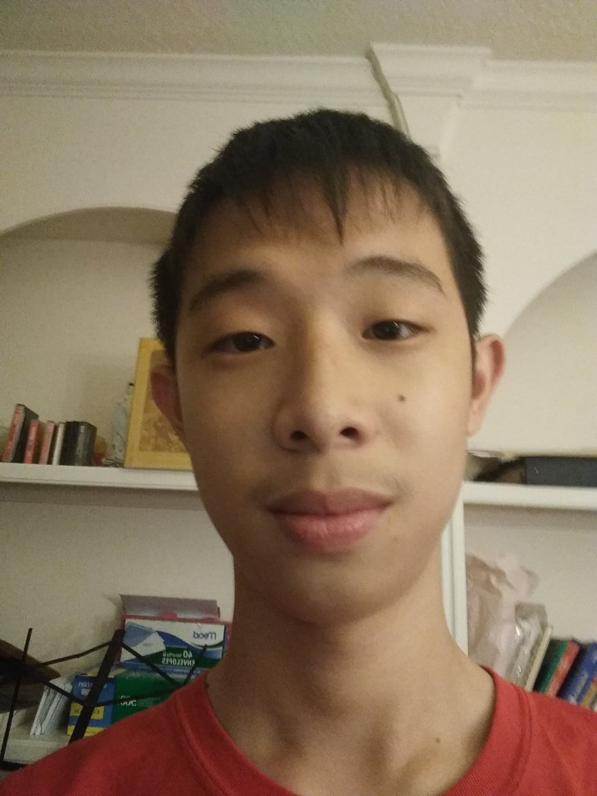
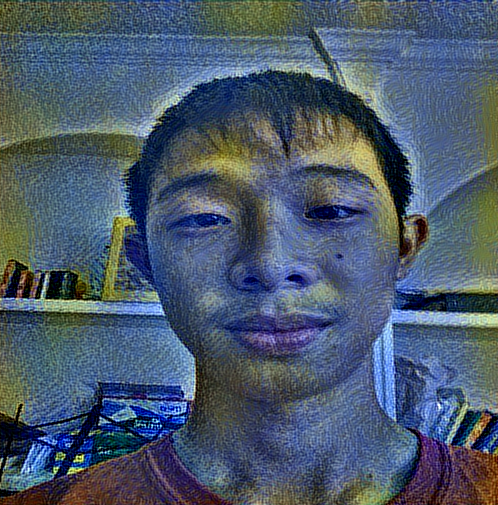

# Artistic-Style-Image-Neural-Net
This program takes two images ( one for content, one for the style ), and combines the two, in a way that you have a features from both images.

In this case, the picture used for content was a picture of myself

And the style picture, was a famous art, called Starry Night, by Vincent Van Gogh

And the combined result was

